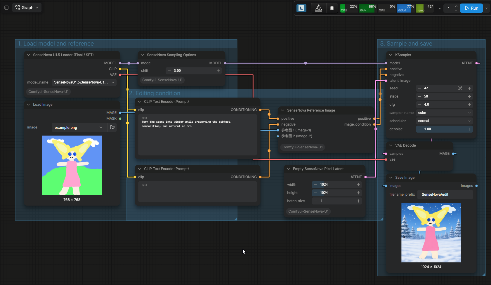

# Comfyui-SenseNova-U1.5-Wrapper-T8 (ConvRot Quantization Fork)



[](LICENSE)
[](https://huggingface.co/Milor123/ComfyUI-ConvRot-SenseNova-U1.5-8B-MoT-T8)
[](https://github.com/T8mars/Comfyui-SenseNova-U1.5-Wrapper-T8)

Native ComfyUI nodes for **SenseNova-U1.5-8B-MoT** (any-to-any: text-to-image, single-image editing, multi-reference editing, batch generation), forked from [T8mars' wrapper](https://github.com/T8mars/Comfyui-SenseNova-U1.5-Wrapper-T8) and extended with **ConvRot quantization support** so the 50 GB bf16 model runs on a 12 GB GPU.

**Quantized weights live here:** [Milor123/ComfyUI-ConvRot-SenseNova-U1.5-8B-MoT-T8](https://huggingface.co/Milor123/ComfyUI-ConvRot-SenseNova-U1.5-8B-MoT-T8)

## Models & downloads

| Download | Size | Place it in |
|---|---|---|
| [SenseNova-U1.5-8B-MoT-T8-hybw4a8-L18-41.safetensors](https://huggingface.co/Milor123/ComfyUI-ConvRot-SenseNova-U1.5-8B-MoT-T8/resolve/main/SenseNova-U1.5-8B-MoT-T8-hybw4a8-L18-41.safetensors) | 13.80 GiB | `ComfyUI/models/diffusion_models/SenseNovaU1.5/` |
| [SenseNova-U1.5-8B-MoT-T8-int8-convrot-tagged.safetensors](https://huggingface.co/Milor123/ComfyUI-ConvRot-SenseNova-U1.5-8B-MoT-T8/resolve/main/SenseNova-U1.5-8B-MoT-T8-int8-convrot-tagged.safetensors) — **recommended** | 17.58 GiB | `ComfyUI/models/diffusion_models/SenseNovaU1.5/` |
| [SenseNova-U1.5-8B-MoT-LoRA-8step-ComfyUI.safetensors](https://huggingface.co/Milor123/ComfyUI-ConvRot-SenseNova-U1.5-8B-MoT-T8/resolve/main/Loras/SenseNova-U1.5-8B-MoT-LoRA-8step-ComfyUI.safetensors) | 0.76 GiB | `ComfyUI/models/loras/` |

## What this fork adds

- **ConvRot-aware quantized inference** (`sensenova_u15/quant_bridge.py`): explicit activation rotation + manual dequantization for INT8 ConvRot, and comfy-kitchen kernel routing for W4A4 / W4A8 — ComfyUI's generic dispatch silently skips the rotation these checkpoints require.
- **QuantizedTensor runtime guards** (`qt_guards.py`): neutralizes the dtype-cast paths in ComfyUI weight streaming (`cast_to_device` / `Tensor.to(dtype)`) that corrupt packed quantized tensors when LoRAs are applied.
- **Static checkpoint contract** (`sensenova_u15/checkpoint_contract.py`): deterministic key/shape/dtype validation immune to the partial `state_dict` that meta-model construction returns inside full ComfyUI sessions.
- **Hybrid checkpoint tooling** (`tools/make_hybrid_ladder.py`): byte-level merging of validated INT8 and W4A8 checkpoints into hybrid files — no re-quantization involved.
- **INT4 converter** (`tools/convert_sensenova_int4_convrot.py`): self-contained W4A4 / W4A8 / mixed-mode converter built directly on comfy-kitchen layouts, with sequential (mmap-free) reads for large files.
- **Headless test harness** (`tests/headless/`): capture, compare, first-divergence and validation scripts used to debug quantization numerically without launching the ComfyUI UI.

All upstream features are retained: text-to-image, single-image edit, 1-10 reference-image editing, 1-16 outputs per prompt, standard `KSampler`, U1.5 Final and SFT weights, the official 8-step speed LoRA, three-path `img_cfg` guidance, CFG Norm, and structured edit prompts. Workflows live in `examples/`: `result-t2i-8step-2048.json` is the maintained example for this fork; original upstream workflows are archived in `examples/old examples (without my nodes)/` for reference.

## Install

Clone into `ComfyUI/custom_nodes/`:

```bash
git clone https://github.com/Milor123/ComfyUI-SenseNova-U1.5-ConvRot.git
```

Requires ComfyUI with **comfy-kitchen >= 0.2.31**. Download quantized weights from the [model repo](https://huggingface.co/Milor123/ComfyUI-ConvRot-SenseNova-U1.5-8B-MoT-T8) into `ComfyUI/models/diffusion_models/SenseNovaU1.5/`.

## Quantization findings

This model tolerates W4A8 activation quantization in its later transformer layers but **not in its earliest ones**: the hybrid release anchors layers 0-17 in INT8 (bf16 activations) and runs layers 18-41 in W4A8. The boundary was located empirically with a bisect ladder of hybrid checkpoints. See the model card for measured numbers (INT8: 0.43% pixel diff vs bf16; hybrid: visually indistinguishable in same-seed A/B).

## Performance

On an RTX 4070 12 GB, both the INT8 and the hybrid W4A8 variants run surprisingly fast even though the model exceeds VRAM: ComfyUI streams weights on demand, and the quantized formats move 3-4x fewer bytes per step while computing through fast integer tensor-core kernels — so the overflow never turns into a slowdown. bf16 is a different story: it streams ~47 GB per step and feels drastically slower.

## Credits

- [T8mars](https://github.com/T8mars/Comfyui-SenseNova-U1.5-Wrapper-T8) - upstream wrapper (Apache-2.0)
- [sensenova](https://huggingface.co/sensenova/SenseNova-U1.5-8B-MoT) - original model (Apache-2.0)
- ConvRot - Hanzuliang et al., technical notes in [Comfy-Org/ComfyUI#14735](https://github.com/Comfy-Org/ComfyUI/issues/14735)
- [silveroxides/convert_to_quant](https://github.com/silveroxides/convert_to_quant) - INT8 conversion lineage
- [Comfy-Org/comfy-kitchen](https://github.com/Comfy-Org/comfy-kitchen) - quantized tensor runtimes

## License

Apache-2.0 (see [LICENSE](LICENSE) and [NOTICE](NOTICE)).
